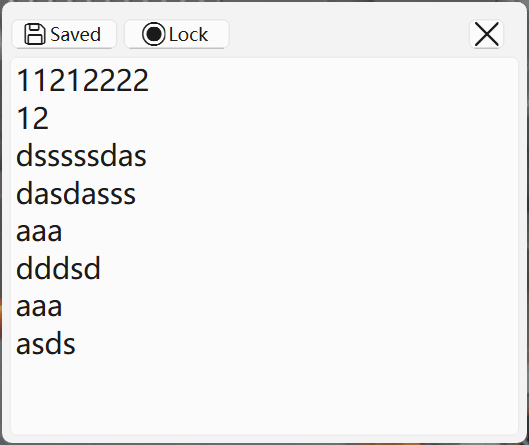

This program are designed to appear with your desktop. After you pressed the Win+D and other windows disappeared, it would still be there.

it`s a simple memo but not todo list.

I don\`t know how to use user32 by c#, so I choose QT

# 这个项目是什么

这个项目旨在创建一个能够与电脑桌面同步出现的便签. 

当你按下Win+D时, 其他的窗口都缩小了, 而它会出现在屏幕上, 这样你就能很方便地查看你的便签. 

同时它也不会出现在你的任务栏与alt+tab中.

# 它和类似的项目有什么不同

首先, 确实有不少便签软件, 我们首先排除掉不能附着在屏幕上的, 再排除掉永远置顶的, 这两种情况并不是本项目的目标场景. 

而其他能与屏幕同时出现的软件: 小黄条改收费了, 之前用的是他; xhznl-todo-list 挺好的, 但是他没有我贴的稳, 按Win+D之后它也会消失, 需要点一下别的窗口才能出现, 但人家界面好看, 毕竟c#. 

并且我只做了一个大的输入框, 因为这是便签而不是todo-list, 我打算分两个项目, 便签做的简单一点, todo-list可以去做每日刷新之类的乱七八糟的功能.

它现在长这样:

小黄条其实之前也会有这个Win+D消失毛病, 不知道收费版解决没有, 其实挺简单的, 最后讲. 下面列了一下类似的项目, 可以看看, 顺便大家提一点, 咱可以把好的项目整理起来一块儿对比一下.

# 一些类似的项目可以看看:

https://github.com/xiajingren/xhznl-todo-list

https://github.com/li-zheng-hao/StickyNotes

https://github.com/tylhk/StickyNotes

# 代码结构指路

StickyNote下的StickyNote为桌面便签窗口,Monitor监听前台窗口变化, 当切换到桌面时发出信号, 随后Elevator负责将窗口移动到顶端, Memo为输入区域, 负责监听输入并保存

ToolBar为顶端工具条

# 驻留原理概述

我是用winapi搞定的, c#没用明白winapi, 跑了没效果, 本来想试试avalona的, 最后只好用c++写qt. 思路是先hook到EVENT_SYSTEM_FOREGROUND, 用FindWindow("Progman","Program Manager")获取桌面比较一下当前是不是桌面, 然后用SetWindowPos先设为HWND_TOPMOST过一小会儿再设为HWND_NOTOPMOST就好了, 必须要过一小会, 可能是因为Win+D有动画吧. 如果你们的不能在win+D之后保持在桌面上, 可能延长一下这个时间就好了, 之后有空写进配置里吧.
